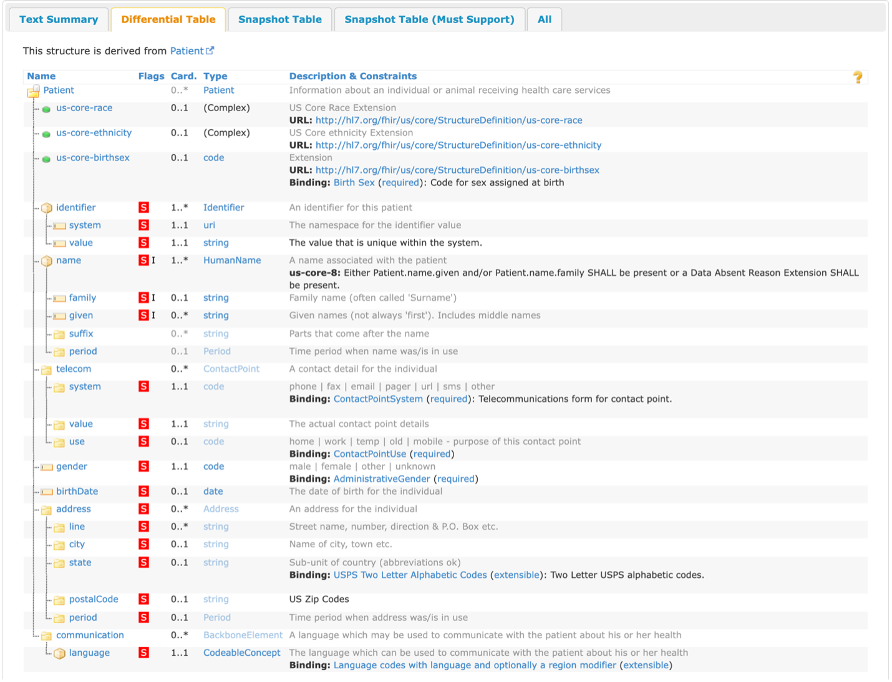
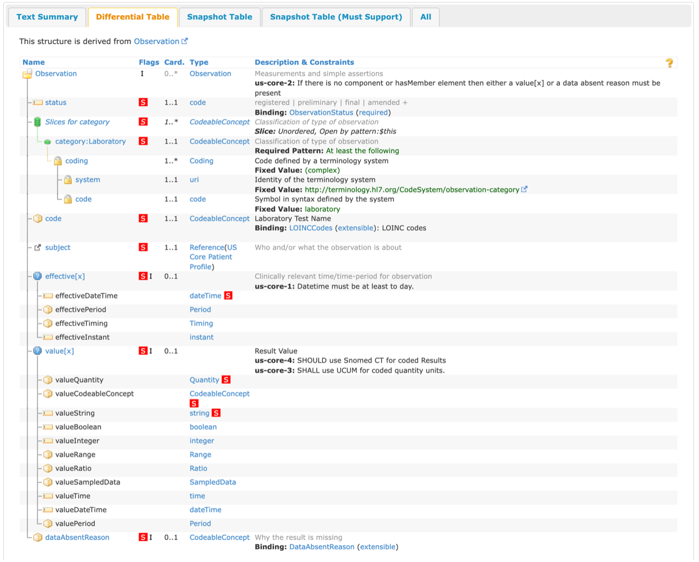

FHIR Implementation Guides (IGs)
================================

Introduction
------------
This document is intended to be an introduction to FHIR Implementation Guides (commonly referred to as FHIR IGs) and how they are used, as well as some examples of what an implementation guide would normally contain and links to more in-depth reading. This document is not intended to be a complete walkthrough of everything about FHIR IGs but should be a good beginning point for a user to understand what they mean and how to begin using them. 
 
IGs contain two different kinds of resource references:

* Contents:  A set of logical statements which implementations must conform to, these are almost always conformance resources (see Definition Instances for an exception to this) 
* Examples: Examples that illustrate the intent of the profiles defined in the IG 
 
Why do IGs exist? Why doesn’t FHIR cover everything?
^^^^^^^^^^^^^^^^^^^^^^^^^^^^^^^^^^^^^^^^^^^^^^^^^^^^
The base FHIR specification describes a set of base resources, frameworks, and APIs that are used in many different contexts in healthcare. However, there is wide variability between jurisdictions and across the healthcare ecosystem around practices, requirements, regulations, and what actions are feasible. For this reason, the FHIR specification is a "platform specification" - it creates a common foundation on which a variety of different solutions are implemented. Because of this, the FHIR specification usually requires further adaptation to contexts of use. Typically, these adaptations specify: 

* Rules about which resource elements are or are not used, as well as what additional elements are added that are not part of the base specification (using Extensions) 
* Rules about which API features are used, and how 
* Rules about which terminologies are used elements 
* Descriptions of how the Resource elements and API features map to local requirements and/or implementations 
Note that because of the nature of the healthcare ecosystem, there may be multiple overlapping sets of adaptations. 
 
IGs versus the ImplementationGuide resource 
^^^^^^^^^^^^^^^^^^^^^^^^^^^^^^^^^^^^^^^^^^^
FHIR IGs are not to be confused with the actual ImplementationGuide resource found in the FHIR specification. A FHIR IG is a complete set of profiles, extensions, terminology, and examples that define a set of rules of how a particular interoperability or standards problem is solved using FHIR resources, while the ImplementationGuide resource is a single FHIR resource that defines the logical content of the IG, along with the important entry pages for the publication. 
 
IG Versioning 
^^^^^^^^^^^^^
FHIR IGs developed and maintained by HL7 must go through a balloting process, like how the FHIR spec evolves over time. This means that “popular” IGs often have multiple versions, culminating in a “Build” (or Continuous Integration/Continuous Development [CI/CD]) version that should be considered volatile and **can change at any time**. After passing a balloting process for the first time, the IG will be released formally as Standard for Trial Use (STU) 1. Every time the IG passes a ballot, they can formally increment the STU version. For example, the US Core IG’s current publication is STU 4 (with STU 5 being a work in progress) and the eCR IG’s current publication is STU 1 (with STU2 being a work in progress). 
 
StructureDefinition Resource 
^^^^^^^^^^^^^^^^^^^^^^^^^^^^
Profiles and extensions are going to take form as a FHIR StructureDefinition resource. Every FHIR resource has an underlying StructureDefinition, as this is how data elements are defined as well as their associated rules. By creating a StructureDefinition that defines a profile on a certain resource, this allows the definitions of the structures to be shared and published through repositories of structure definitions, compared with each other, and used as the basis for code, report, and UI generation. These are almost always created using a point-and-click software or by using FHIR ShortHand, more on these tools can be found in IG Creation Tools. 
 
FHIRPath 
^^^^^^^^
Please note that this document may make use of “FHIRPath” to provide a consistent reference to FHIR data structures. FHIRPath provides for a path string from a base resource through elements and nested elements within a resource, along with some accompanying functions where needed. This document will only be using the path notation itself. For an example, the Patient resource has an element called “name”. A name is a FHIR data type of “HumanName” which consists of several additional elements that you would expect to be associated with a name, such as “given”, “family”, “suffix”, and so forth. So, to reference the entire name element consisting of all these elements, the following notation is used: Patient.name. To then reference a specific sub-element, it would simply take the reference chain one further: Patient.name.given.  
 
Please be aware as well that FHIR uses “0 indexing” for list items—elements that can have more than one occurrence (maximum cardinality greater than 1). In the case of the “HumanName” type, given is a list element with 0..* while “family” is not, with a 0..1 cardinality. Given the use of “0 indexing”, the first “given” of the first “name” would be referenced as: Patient.name[0].given[0]. **Please be aware that usages of “[x]” are not intended to indicate indexing. “[x]” is a specific FHIR notation for choice of data type elements.** 
 
Example FHIR IGs 
^^^^^^^^^^^^^^^^
Listed below are a few sample FHIR IGs that can be browsed to see more complete examples of IGs (note that these are all linked to the most recent published STU versions, **NOT** the CI/CD versions). All examples used in this document will come from the US Core IG. 

* US Core (https://www.hl7.org/fhir/us/core/) 
* Electronic Case Reporting (eCR) (http://hl7.org/fhir/us/ecr/) 
* Vital Records Mortality and Morbidity Reporting (a.k.a. VRDR) (http://hl7.org/fhir/us/vrdr/) 
* Occupational Data for Health (ODH) (http://hl7.org/fhir/us/odh/) 

Profiles 
--------
Profiles are going to be the most common conformance resource found in a FHIR IG. A profile is a set of rules around how a FHIR resource should be used in the context of the IG, as well as any additional elements that may need to be added to support the use case of the IG. Profiles can be created for any FHIR resource needed for the context of the IG, such as Patient, Condition, or Observation. There are at least six different ways that a profile can constrict or “change” (change being a loose term since profiles are not changing the base FHIR specification) a FHIR resource: 

* Extending a data element by adding an Extension (see Extensions for more detail) 
* Changing the cardinality of an element 
* Restricting an allowed data type for a choice element 
* Fixing a value of an element 
* Constricting the value set from which a code, Coding, or CodeableConcept can come from for a data element 
* Adding a flag to a data element 
 
Changing the Cardinality 
^^^^^^^^^^^^^^^^^^^^^^^^
Every data element in a FHIR resource has a cardinality: the lower and upper bounds for how often an element can appear in a resource. This is represented in the following notation in the FHIR specification: lower .. upper. The most common cardinalities are 0..1 (not required but the element can only exist once in the instance of a resource), 0..* (not required but the element can exist infinitely many times in the instance of a resource), 1..1 (required but the element can only exist once in the instance of a resource), and 1..* (required but the element can exist infinitely many times in the instance of a resource). This cardinality can only be restricted within the bounds of the base FHIR specification; it cannot be expanded. The table below shows an example of what is and isn’t allowed: 

+------------------------+------+------+------+------+------+
| Derived (across)       | 0..0 | 0..1 | 0..n | 1..1 | 1..n |
| Base (down)            |      |      |      |      |      |
+========================+======+======+======+======+======+
|  0..1                  | Yes  | Yes  |  No  | Yes  |  No  |
+------------------------+------+------+------+------+------+
|  0..*                  | Yes  | Yes  | Yes  | Yes  | Yes  |
+------------------------+------+------+------+------+------+
|  1..1                  |  No  |  No  |  No  | Yes  |  No  |
+------------------------+------+------+------+------+------+
|  1..*                  |  No  |  No  |  No  | Yes  | Yes  |
+------------------------+------+------+------+------+------+

Restricting a Choice Element 
^^^^^^^^^^^^^^^^^^^^^^^^^^^^
Within the base FHIR specification, there are elements labeled with a [x] that are called choice elements, these elements can take the form of multiple data types depending on the implementation. For example, the value[x] element in the Observation resource can take on one of 12 different data types depending on the implementation. A profile can restrict these choice elements to either a subset of the original choices or a single data type. This also applies to elements that have a type of Reference with multiple choices of other resources for the reference, it can even be restricted to be a Reference to a resource that conforms to another one of the IG’s profiles. 
 
Fixed Values and Bindings 
^^^^^^^^^^^^^^^^^^^^^^^^^
For some data elements in FHIR, there is a fixed value, which means that that element can only equal that fixed value in a data structure (if it has 1..n cardinality, it will always be in any instance of that resource but 0..n means that it’s not required to exist in any instance of the resource). For some other data elements (always elements with a code, Coding, or CodeableConcept data type), there might be a binding with a defined value set. In the FHIR specification, there are four different binding strengths that can exist for the relationship between a data element and a value set, shown in the below table (taken from the FHIR specification): 

+------------+----------------------------------------------------------------------------------------------------------------------------------+
| Strength   | Definition                                                                                                                       |
+============+==================================================================================================================================+
| Required   | To be conformant, the concept in this element SHALL be from the specified value set                                              |
+------------+----------------------------------------------------------------------------------------------------------------------------------+
| Extensible | To be conformant, the concept in this element SHALL be from the specified value set if any of the codes within the value set can |
|            | apply to the concept being communicated. If the value set does not cover the concept (based on human review), alternate codings  |
|            | (or, data type allowing, text) may be included instead.                                                                          |
+------------+----------------------------------------------------------------------------------------------------------------------------------+
| Preferred  | Instances are encouraged to draw from the specified codes for interoperability purposes but are not required to do so to be      |
|            | considered conformant.                                                                                                           |
+------------+----------------------------------------------------------------------------------------------------------------------------------+
| Example    | Instances are not expected or even encouraged to draw from the specified value set. The value set merely provides examples of    |
|            | the types of concepts intended to be included.                                                                                   |
+------------+----------------------------------------------------------------------------------------------------------------------------------+

Preferred is going to be the least common binding strength found both in the FHIR specification as well as any FHIR IGs, as most FHIR IGs are going to make use of the “required” binding strength since they are constricting the base specification to a specific use case. 
 
Value sets must exist somewhere for a data element to have a binding relationship with it. Most commonly they will be found within the realm of HL7 terminology, but can also exist within CDC’s PHINVADS, NIH’s VSAC, or can be defined within the FHIR IG as a ValueSet within the IG (see ValueSets for more information on custom ValueSets). 
 
The table below shows how a binding strength could be changed in a profile (note that the constraining profile can change either the strength or the value set of the bidning, but whatever the profile does, it cannot make codes valid that are invalid in the base specification): 

+------------------------+----------+------------+-----------+---------+
| Derived (across)       | required | extensible | preferred | example |
| Base (down)            |          |            |           |         |
+========================+==========+============+===========+=========+
|  requires              | Yes      | No         | No        |     No  |
+------------------------+----------+------------+-----------+---------+
|  extensible            | Yes      | Yes        | No        |     No  |
+------------------------+----------+------------+-----------+---------+
|  preferred             | Yes      | Yes        | Yes       |     No  |
+------------------------+----------+------------+-----------+---------+
|  example               | Yes      | Yes        | Yes       |    Yes  |
+------------------------+----------+------------+-----------+---------+

Flagging a Data Element 
^^^^^^^^^^^^^^^^^^^^^^^
The final way explored in this document that a profile can constrict a FHIR resource is by adding a flag to the data element. This almost always occurs with a mustSupport flag, where an IG can add this flag to indicate that systems claiming to conform to a given profile must "support" the element. This is distinct from cardinality; it is possible to have an element with a minimum cardinality of 0 but still expect systems to support the element. Note that the base FHIR specification does not define “support,” but if a profile chooses to include the flag, it must also describe what kind of “support” is expected. Examples of this include: 

* The system must be able to store and retrieve the element 
* The system must display the element to the user and/or allow the user to capture the element via the UI 
* The element must appear in an output report 
* The element must be considered when performing decision support, calculations, or other processing 

Slicing 
^^^^^^^
A common feature found in profiles in a FHIR IG is slicing. Slicing is the act of taking an element that may appear multiple times (for example, in a list) and splitting the list into a series of sub-lists, each with different restrictions on those sub-lists. This is an example taken from the FHIR specification: 

.. image:: 
   images/fhir_slicing.png
   :width: 350pt
   :alt: FHIR Slicing 
   
The base Observation resource is on the left, with the derived Blood Pressure Profile on the right. In this example, we are slicing the data element component into two slices: systolic and diastolic (since there are two components to a blood pressure observation, you would use the component elements with separate codes and values versus having two separate Observations). The component has been sliced into those two slices, each one with a fixed value of the code for systolic and diastolic, respectively, with a restriction on value[x] to be of type Quantity. More information on the details of slicing is found here http://www.hl7.org/fhir/r4/profiling.html#slicing. 

Invariants (or Constraints)
^^^^^^^^^^^^^^^^^^^^^^^^^^^
A profile can also contain what are called either constraints or invariants (invariants will used for the rest of the document to provide clarity between these statements and any changes a profile may make to a resource). These are FHIRPath expressions that must evaluate to true when run against an element in an instance for a resource to be considered conformant to the IG. An example of this is:

+------------+--------------+------------------------------------------------------------------------------------------------------+
| Key        | Path         | Description                                                                                          |
+============+==============+======================================================================================================+
| us-core-8  | Patient.name | Either Patient.name.given and/or Patient.name.family SHALL be present or a Data Absent Reason        |
|            |              | Extension SHALL be present: (family.exists() or given.exists()) xor                                  |
|            |              | extension.where(url=\'http://hl7.org/fhir/StructureDefinition/data-absent-reason\').exists()         |
+------------+--------------+------------------------------------------------------------------------------------------------------+

Formal Views of Profile Content
^^^^^^^^^^^^^^^^^^^^^^^^^^^^^^^
Each FHIR IG has a section labeled as “Formal Views of Profile Content,” this section has an interactive box with five different tabs: Text Summary, Differential Table, Snapshot Table, Snapshot Table (Must Support), and All. The “Text Summary” tab gives a summary of the profile: what resource it constrains, how many mandatory and must support elements there are, any other profiles the profile may refer to, and any extensions the profile may refer to. The “Differential Table” tab shows all the elements that the profile has changed: adding a mustSupport flag, restricting the cardinality (indicated with black text versus gray text), restricting the data type, changing the terminology binding, or any invariants that may have been defined for the profile. The “Snapshot Table” tab shows a blend of the differential table and the base resource structure, by showing all elements for this profiled resource. The “Snapshot Table (Must Support)” tab only shows all the data elements that have been flagged with the mustSupport flag. The “All” tab shows all of the previous four views on the same page. 

Examples
^^^^^^^^
As mentioned previously, all examples shown in this document come from the US Core FHIR IG.

US Core Patient
^^^^^^^^^^^^^^^
Shown below is the differential table from the US Core Patient Profile:

From this table, there are three extensions defined that have a cardinality of 0..1, with two of them being “(Complex)” extensions and one being a code. These extensions will be covered in the Examples section below for extensions, as well as what “(Complex)” extensions are. There are a total of 18 elements that have been flagged as mustSupport (as defined above) and three mandatory top-level elements (compared to the base Patient which has 0 mandatory top-level elements). On Patient.name, the invariant previously mentioned has been applied to this element, indicating that an instance of a resource claiming conformance to this profile must follow that invariant.

US Core Laboratory Result Observation
^^^^^^^^^^^^^^^^^^^^^^^^^^^^^^^^^^^^^
Shown below is the differential table from the US Core Laboratory Result Observation Profile:

In this differential table, you can see an example of slicing that was mentioned before. For this example, the profile changed the cardinality of category from 0..* in the base Observation to 1..* for this profile, indicating that there should be at least one category code associated with an instance of a resource conforming to this profile. In this case, the slice “Laboratory” has a cardinality of 1..1 and has a fixed value of laboratory, indicating that this category code will appear in every instance of a resource conforming to this profile. Because the cardinality is 1..*, other category codes could be included, but those do not have any additional constraints beyond the base specification. 

For this profile, there are 12 mustSupport flags and four mandatory top-level elements. For Observation.code, there is an example of the profile changing the binding strength for the associated value set. In the base specification, the value set “LOINCCodes” has a binding of example, but for this profile, it has a strength of “extensible.” There are also four invariants applied to this profile, one for the entire Observation and three for individual elements within the resource. It’s also demonstrated here the concept of mustSupport and constraints. For Observation.value[x], there are mustSupport flags on three of the data types, but the other data types from the base specification are still allowed.

Extensions
----------
Sometimes when profiling FHIR for your use case, you may come across a situation where you don’t need to limit a resource, but rather add elements. This is where Extensions come in, they can be added to any data element (from the base resource down to the most nested element) to represent additional information that is not present in the base resource. Extensions must contain a URL to define what it means to have that extension as well as a value[x] element (see Restricting a Choice Element to hear more about value[x], as well as go to Open Type Element to see the full list of datatypes this element can have). 

Sometimes, you may need to have multiple values to represent the full meaning of an extension and instead of doing multiple extensions, you can have an extension which contains sub-extensions. This is referred to as a complex extension, and excellent examples of this are the US Core Race and Ethnicity extensions. Both contain three sub-extensions: a required extension with a url of ombCategory and a valueCoding from the OMB Race Categories ValueSet, an optional extension with a url of detailed and a valueCoding from the Detailed Race ValueSet, and a required extension with a url of text and a valueString. The StructureDefinition for the US Core Race extension is shown below:

.. image:: 
   images/fhir_extension.png
   :width: 500pt
   :alt: FHIR Extension 

Another rule to note with using sub-extensions that you can see demonstrated in the StructureDefinition above: you cannot have sub-extensions as well as a value[x] element, this muddies the meaning of the extension. 

Another concept that can be found with extensions is the presence of an is-Modifier flag, which makes them modifier extensions. A modifier extension is where the information provided in an extension modifies the meaning of the element that contains it. Often, this means information that qualifies or negates the primary meaning of the element that contains it. An example of this is a flag on a [Patient.contact] indicating they are not to be contacted - i.e. a next of kin for record-keeping purposes only. IG developers should try to stay away from modifier extensions wherever possible because it can change the meaning of an element in a resource and can add confusion to data. 

Terminology
-----------
CodeSystems
^^^^^^^^^^^
Sometimes, a code may not exist for the domain in which an IG is being developed, or a code may need to be used that has not been fully incorporated into a published codesystem. This leads to IG developers needing to create a CodeSystem to contain these codes they may need for providing fixed values or creating a ValueSet binding (more on ValueSets below). The new codesystem needs to have a defined canonical URL that will be used whenever a code from the system is referenced, and all of the defined codes need to have the actual code, a display name, as well as a description. All these items are highly recommended for custom codesystems so an implementer can know what the code means and when it should be used. 

ValueSets
^^^^^^^^^
ValueSets are created by IG developers when they would like to constrict a code element to only come from a specific set of codes. This could happen when there’s not an appropriate ValueSet that already exists, when using codes from a custom codesystem that do not exist outside of the IG, or you want to limit or expand an existing ValueSet. 

Instances
^^^^^^^^^
Instances are also known as examples, but for this guide, they will be referred to as instances since most IG authoring tools refer to them as such and so they do not become confused with the example type of instances. An instance will conform to a given profile (or base resource if needed) to be considered as an instance of a given profile. Most of the time, instances contain more data that one would find in the resource in a production environment as to show implementers the full use of a profile. There are two main different kinds of instances: example and definition instances. Example instances are named because they are examples of the profiles and extensions found in an IG and will be included on the Examples tab of a profile page. Definition instances are conformance items that is an instance of a resource such as a search parameter, operation definition, or questionnaire, and these items will be presented on their own IG page.

Example Instances
~~~~~~~~~~~~~~~~~
Examples instances are created just how you would create any other resource, only now they will be conforming to a certain profile or extension. To mark an example instance as conforming to a profile, there is a profile sub-element in the resource’s meta element that would contain the profile’s canonical URL. So for example, looking at an example that conforms to the US Core Patient, the element Patient.meta.profile[0] would have http://hl7.org/fhir/us/core/StructureDefinition/us-core-patient to indicate that its conformant to that profile. Note the [0] at the end of that FHIRPath, this means that a resource could conform to multiple profiles. 

