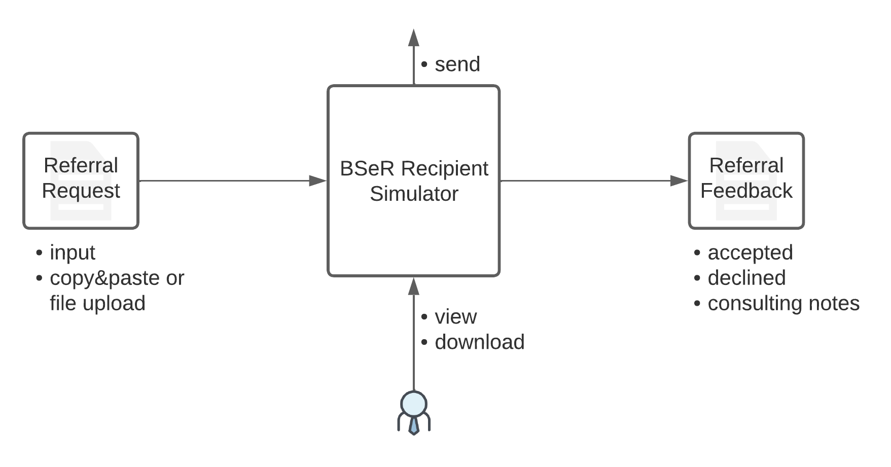

BSeR Reference Implementation
=============================

Architecture
------------
Georgia Tech Research Institute (GTRI) has developed an architecture for a reference implementation of the BSeR FHIR IG and implemented an initiator application and recipient simulator. The architecture is designed to support various environment and intermediate stages until the BSeR FHIR IG becomes mature. Figure 1 depicts the architecture.

.. image::
   images/bser_ref_imp/BSER_RI_Architecture.png
   :width: 520pt
   :alt: BSeR Reference Implementation Architecture

**Figure 1**\ : BSeR Reference Implementation Architecture

BSeR IG defines two main system roles, initiator and recipient. The initiator is the system in the clinical provider site that composes the electronic referral (e-Referral) request and sends to the recipient. The recipient is a system in the service provider site that consumes the e-referral request(s), processes the request(s), and responds with feedback.

The initiator has a BSeR App that implements the following features for the clinical provider:

* Authentication and authorization using SMART-on-FHIR within the EHR to access patient data
* User interface/dashboard for providers to compose the e-Referral request and send to a service provider
* View or import feedback data from service provider
* Provides an *FHIR messaging operation* endpoint for recipient to send feedbacks

.. note::
   Detailed information about the *FHIR messaging operation* can be found from https://hl7.org/fhir/R4/messageheader-operation-process-message.html.

   Although the *FHIR messaging operation* is not required by BSeR FHIR IG, it is recommended so that systems can have common
   standardized way of exchanging data.

Users of BSeR App in the initiator are clinical providers who refer patients to a service provider (recipient). The BSeR App in the initiator is to help users to create e-referral requests as defined in BSeR FHIR IG and send them to service providers at the recipient side. BSeR App in the initiator is a SMART-on-FHIR app that complements EHR for BSeR functionality.

The recipient also has a BSeR App that implements the following features for service providers,

* Bridge between BSeR and service management
* *FHIR messaging operation* endpoint for e-referral request messages
* Interfaces to communicate with service management (e.g. API, Email, SFTP, etc.)
* Mapping between BSeR FHIR IG data and service management system data

The architecture describes the BSeR App in the recipient to support various interfaces to the service management platform. However, not every service provider is equipped with a modern network technology for the management tool. To support more providers, the architecture includes not only APIs, but also emails or File Transfers for the interfaces to the service management platform.

.. note::
   For recipients with a manual system for the service management such as emails or SFTP, BSeR App may need to provide
   a dashboard for the recipient users to manually trigger the service feedbacks.

The recipient's BSeR app, once it receives the e-Referral request, parses the request, responds to the initiator with a HTTP status, and then hands the request data over to the service management system through the interface(s).

Initiator (Clinical Provider)
-----------------------------
GTRI has developed a proof-of-concept initiator system based on the architecture outlined above. The proof-of-concept implementation is depicted in Figure 2. The BSeR App is split into two parts: the UI and engine. The UI provides a dashboard functionality to users and show data elements that need to be captured for each of BSeR use cases. Once the user clicks on the send button, the engine takes the information, constructs BSeR FHIR IG-based e-referral request, and sends it to the selected recipient.

.. image::
   images/bser_ref_imp/BSER_RI_Initiator_App.png
   :width: 520pt
   :alt: Proof of Concept Implementation of BSeR Initiator System

**Figure 2**\ : Proof of Concept Implementation of BSeR Initiator System

Recipient (Service Provider)
----------------------------

For the recipient, GTRI has developed a recipient simulator. Recipient system needs to parse the e-referral request messages appropriately based on the use cases defined in the BSeR IG. The parsed data should then be delivered to the service management application to process the request. The service management application should then send feedbacks as responses to the initiator during the course of referred service(s).

The recipient simulator provides an api for e-Referral requests, generates feedbacks and responds with feedback. The feedback includes accept, declined, status, etc. as defined by BSeR IG. Figure 3 depicts the recipient simulator.

**Figure 3**\ : Recipient Simulator

Useful Links
------------

Currently, the GTRI sandbox is being migrated to new infrastructure. Once this migration is finished, links will be provided for the service instances.

.. note::
   All artifacts developed for the proof-of-concept implemenations are available in https://github.com/BSeR-PoC.
   Any issues or comments can be made using the GitHub's Issues option under each repository.

