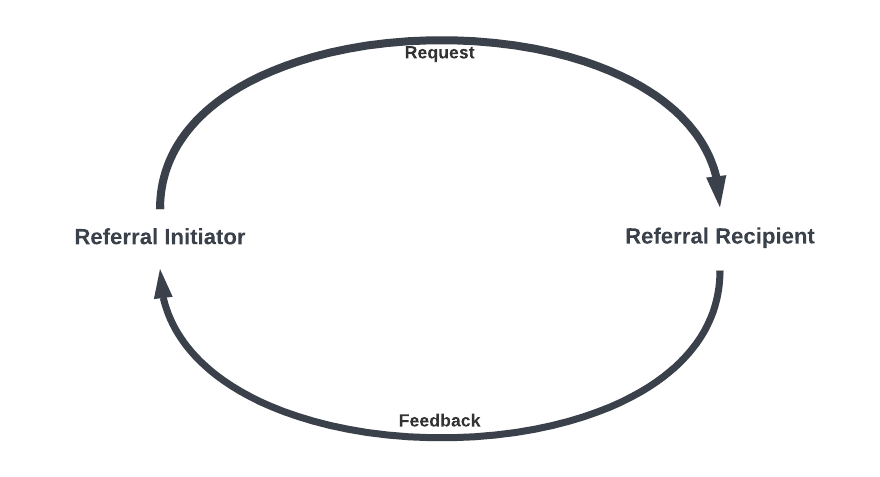

BSeR FHIR Implementation Guide
==============================

Overview
--------
To support the Bidirectional Services eReferral (BSeR) workflows are captured in the FHIR standard through the BSeR Implementation Guide (IG). The
IG can be broadly broken down into three distinct areas:
* Data Exchange
* Workflow Management
* Patient Information Data Models

 Data models are the FHIR profiles which represent both structured artifacts through FHIR Profiles and supporting resources involved in the
act of data exchange (e.g., "message" type Bundles, MessageHeaders) as well as the way to structure the documents contained within messages (e.g.,
"document" type Bundles, individual resources like clinical Observations or the Patient).

Bidirectional Data Exchange and Workflow Management
^^^^^^^^^^^^^^^^^^^^^^^^^^^^^^^^^^^^^^^^^^^^^^^^^^^
The BSeR Implementation Guide documents data exchange using a messaging model, wherein a referral initiator, typically a clinical entity, will send a FHIR
Message Bundle to a recipient, typically a non clincial partner. (Historically, this would be the domain of the HL7v2 messaging standard.)

The bi-directionality aspect of the implementation guide then expands upon this model, laying out not just the initial messaging but iterative messaging
between the initiator and recipient. As it is part of a complete messaging cycle, the roles of "initiator" and "recipient" are defined consistently based on
the *initialization* of the exchang and the entities involved are described this way even in subsequent messages going the opposite direction. The directionality
of the messages is described as "request" (initiator to recipient) and "feedback" (recipient to feedback).

In the context of FHIR, the messaging is captured in the guide through FHIR resources or API expectations such as operations. This is the outermost
layer of the BSeR data structure, starting with the BSeR Referral Message Bundle profile. That profile goes together with the BSeR Referral MessageHeader profile.

Workfow Management
^^^^^^^^^^^^^^^^^
Workflow management ties into the message

Data Models
^^^^^^^^^^^

Use Cases
---------

