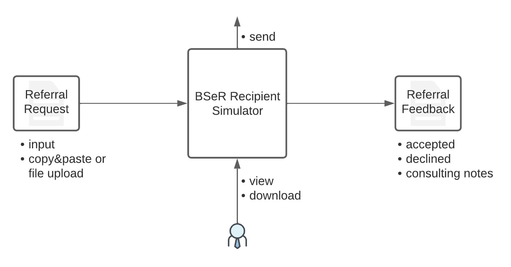

BSeR Reference Implementation
=============================

Architecture
------------
Georgia Tech Research Institute (GTRI) has developed an archteture for reference implementation of BSeR IG and implemented
initator application and recipient simulator. The architecture is designed to support various environment and intermediate 
stages until the BSeR becomes mature. Figure 1 depicts the architecture.   

.. image:: 
   images/BSER_RI_Architecture.png
   :width: 520pt
   :alt: BSeR Reference Implementation Architecture 

**Figure 1**\ : BSeR Reference Implementation Architecture

BSeR IG defines two main system roles, initiator and recipient. Initiator is a system in the clinical provider site that composes 
electronic referral (e-Referral) request and sends to recipient. Recipient on the other hand is a system in the service provider 
site that consumes the e-referral request(s) and process the request(s). 

The initiator has a BSeR App with the following features for the clincal providers,

* Gets authenticated and authorized using SMART on FHIR application to access patient data.
* Provides user interface or dashboard for providers to compose the e-Referral request and send to a service provider.
* View or import feedback data from service provider.
* Provides an *FHIR messaging operation* endpoint for recipient to send feedbacks

.. note::
   Detail information about the *FHIR messaging operation* can be found from https://hl7.org/fhir/R4/messageheader-operation-process-message.html.
   
   Although *FHIR messaging operation* is not required by BSeR FHIR IG, it is recommended so that systems can have common 
   standardized way of exchanging data.

Users of BSeR App are clinical providers who refer patients to a service provider (recipient). BSeR App in the initiator 
is to help the users to create the e-referral requests using BSeR FHIR IG and send them to the service providers at the 
recipient side. Thus, BSeR App should support SMART on FHIR to access patient data. 

The recipient has a BSeR App with the following features for service providers,

* Bridges between BSeR and service management. 
* Provides *FHIR messaging operation* endpoint for e-referral request messages.
* Communicate with a service management interface (e.g. API, Email, SFTP, etc.)
* Mapping between BSeR FHIR IG data and service management system data.

The architecture describes the BSeR App in the recicpient to support various interfaces to the service management platform.
However, not every service provider is equipped with a managment tool. To support such providers, the architecture 
includes not only APIs but also Emails or File Transfers. Recipient, once receives the e-Referral request, should parse the 
request, respond to the initiator with a HTTP status, and then hand over the request data to the service management 
system throught the interface. 

.. note::
   BSeR App for service provider may respond to the incoming e-Referral requests. However, feedbacks such as ``accepted`` or 
   ``declined`` should not be determined by the BSeR App. Service management tool or service providers/staff should make
   the decision and trigger BSeR app to send the feedback messages.

Both e-Referral requests and feedbacks should be responded with a HTTP status code. 

* For success, HTTP 200 or 201 status code if the e-Referral requests or feedbacks are successful received.
* For errors, HTTP 4xx or 5xx status with OperationOutcome FHIR resources in the payload to include detail error descriptions. 

Initiator (Clinical Provider)
-----------------------------
Proof-of-concept initiator system has been developed based on the architecture and maintained by GTRI. The proof-of-concept
implementation is depicted in Figure 2. As it is shown in the Figure 2, BSeR App is broken into two part, UI and engien. UI
provides a dashboard functionality to users and show data elements that need to be captured for each BSeR use case. Once the
user clicks on the send button, the engine takes the information, construct BSeR FHIR IG based e-referral request and send
it to the selected recipient. 

.. image:: 
   images/BSER_RI_Initiator_App.png
   :width: 520pt
   :alt: Proof of Concept Implementation of BSeR Initiator System

**Figure 2**\ : Proof of Concept Implementation of BSeR Initiator System

Recipient (Service Provider)
----------------------------

For Recipient, GTRI developed a recipient simulator. Recipient system needs to parse the e-Referral request messages 
appropriately based on the use cases defined in the BSeR IG. The parsed data should then be delivered to the service 
management to process the request. The service management should then send feedbacks as responses to the initiator 
during the course of referred service(s). 

The recipient simulator takes to e-Referral request FHIR bundle over an API, generates feedbacks and responds with
feedbacks. The feedbacks include accept, declined, status, etc. as defined by BSeR IG. Figure 3 depicts the recipient
simulator.

**Figure 3**\ : Recipient Simulator

Useful Links
------------

Currently, GTRI sandbox is being migrated to new infrastructure. Once this migration is finished, links will be 
provided for the service instances.

.. note::
   All artifacts developed for the proof-of-concept implemenations are available in https://github.com/BSeR-PoC. 
   Any issues or comments can be made using the GitHub's Issues option under each repository.

