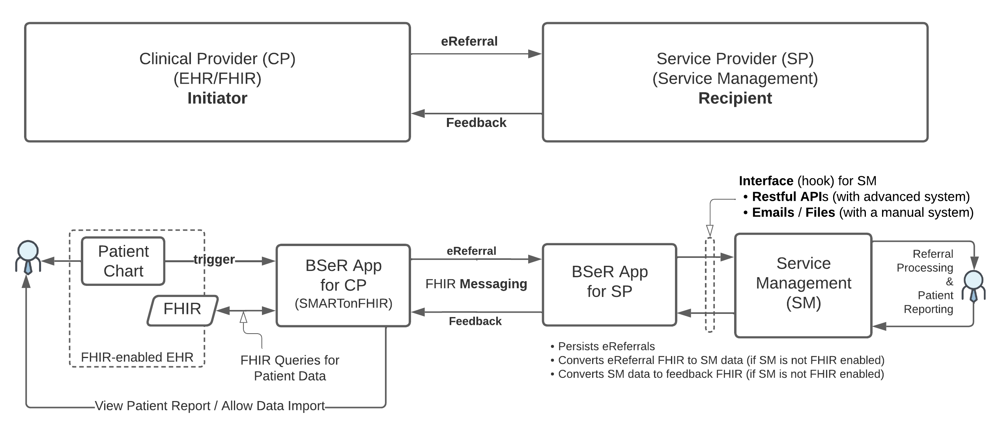
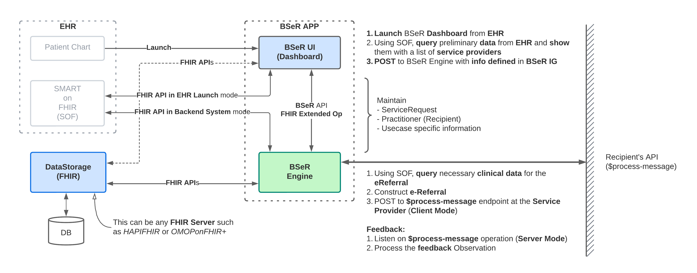

BSeR Reference Implementation
=============================

Architecture
------------
Georgia Tech Research Institute (GTRI) has developed an archteture for reference implementation of BSeR IG and implemented
initator application and recipient simulator. The architecture is designed to support various environment and intermediate 
stages until the BSeR becomes mature. Figure 1 depicts the architecture.   

**Figure 1**\ : BSeR Reference Implementation Architecture

BSeR IG defines two main roles of systems, initiator and recipient. Initiator is a system that composes electronic referral 
(e-Referral) request and sends to recipient. Recipient on the other hand is a system that consumes the e-referral request(s) 
and process the request(s). 

Initiator has a BSeR App for clinical provider that performs the following features,

* SMART on FHIR application that can be launched from EHR's patient chart (EHR launch mode in SMART on FHIR framework). 
* Authorization to access EHR data by provider(s) 
* User interface or dashboard for providers to compose the e-Referral message using patient data, service provider organizations, 
  and specific referral usecase information. 

BSeR App should asynchrously wait for feedbacks from recipient. As the feedback messages are sent by recipient asynchronously, 
BSeR App should match the incoming feedback messages to existing referral cases and update the status of the matching cases. 
The App do not response to the feedback messages as they are the messages that close the bi-directional messaging loop.

In recipient, BSeR App for service provider is a middleware that acts as a bridge between FHIR and service management platform. 
BSeR App should provide an endpoint for initiators to send the e-referral request messages to. Although it is not required by 
BSeR FHIR IG, it is recommended for the recipients to implement the **FHIR Messaging** operation for overall interoperability
improvement. 

BSeR App for service provider may validate the incoming e-Referral requests. However, acceptance or rejection of the referral
request should not be decided by the App as it is out of scope. The validation should be limited to BSeR FHIR IG and internal 
policy such as security. The App parses the request and hands over to the service management platform. Here, the interface
between BSeR App and service management platform can be customized. The architecture neither requires nor recommends the 
technology used for the interface. As the architecture is designed to support all level of technology capabilities at the
service providers, the BSeR App should support the interface that will work for the service management platform. This includes
simple email or file transport for the service providers who do not have the service management software/platform. 

It is recommended to use the **FHIR messaging** operation to send an e-Referral although it is not required by BSeR FHIR IG. 
If the **FHIR messaging** operation are used, it will improve overall interoperability implementation because the messaging 
implementation can be reused for different endpoints without developing custom support for each of endpoints.

HTTP 200 or 201 status code should be returned if the message was successfully received by recipients. HTTP 4xx or 5xx 
status codes can be used if error(s) occurrs. The payload should contain FHIR's OperationOutcome resource to include detail
error descriptions. 

BSeR App for service provider should return HTTP status code 200 or 201 if the referral request was successfully received without
errors. 4xx or 5xx should be returned if error occured. OperationOutcome can be placed in the payload when error response 
is sent to the intiator. BSeR App should not send a BSeR feedback message for this. The BSeR feedback message must be initiated
by the service management platform or service providers. Therefore, the referral request messaging session should be closed
once the HTTP status code is sent back to the initiator.

More details about initiator and recipient will be discussed in the following sections.

Initiator (Clinical Provider)
-----------------------------

Users of initiator are clinical providers who refer patients to a service provider (recipient) and also EHR users. 
EHR in the initiator should be FHIR enabled. Initiator system should support SMART on FHIR in order to access patient
data from EHR. 

Developers of BSeR initiator must work with IT of the clinical provider's EHR so that initiator system will comply with 
the data access policies on reading from and possibly writing to EHR. 

**Figure 2**\ : BSeR Reference Implementation Initiator System

Recipient (Service Provider)
----------------------------

Recipient system needs to parse the e-Referral request messages appropriately based on the use cases defined in the
BSeR IG. The parsed data should then be delivered to the service management to process the request. The service management 
should then send feedbacks as responses to the initiator via recipient system during the referred service(s). Feedbacks
include accept, declined, status, etc. as defined by BSeR IG. 
