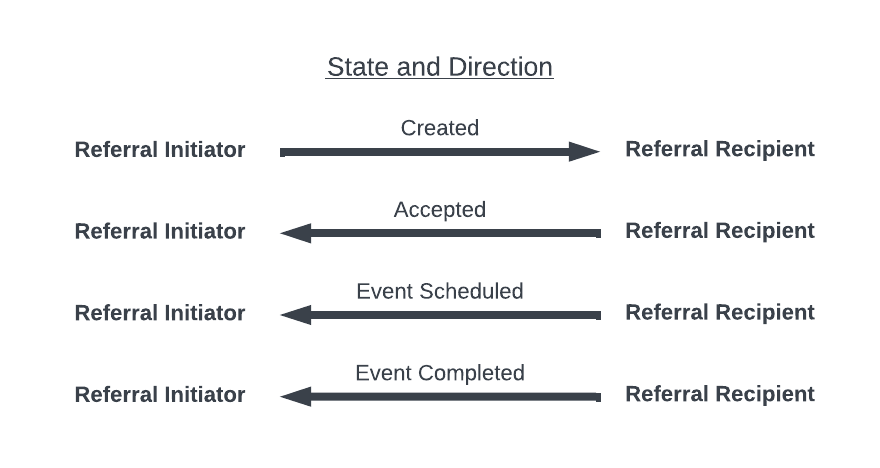

Data Exchange Workflow
======================
To support the BSeR workflows, the IG can be broadly broken down into three distinct areas:

- Bidirectional Data Exchange
- State and Workflow Management
- Patient Information

Bidirectional Data Exchange
---------------------------

Actors
^^^^^^
There are two core actors involved in the actual data exchange during the referall process, broadly labeled the "initiator" and "recipient".

**Initiator** - The initiator is the entity which initiates the referral. This is intended to be a clinical healthcare provider for the majority of cases, but the Implementation Guide does not limit this explicitly and depending on indivudal workflows others, such as intermediary services, may act as an initiator per the way it is defined for the purposes of the BSeR FHIR IG.

**Recipient** - The recipient is the entity which receives the referral and is responsible for the the requested intervention. For the purposes of the BSeR FHIR IG, this is a extra-clinical community partner who offers programs to meet patient needs such as chronic condition management or similar services.

Messaging
^^^^^^^^^
The BSeR Implementation Guide documents data exchange using a "messaging" model. This model of data exchange in BSeR occurs as a referral initiator (typically a clinical entity) will send a FHIR Message Bundle to a recipient (typically a non clincial partner). Historically, this is equivalent to common uses of the HL7v2 messaging standard.

"Messaging" is a *push* model of data exchange, in contrast to *pull* models. From a purely technical perspective, a push model for APIs (Application Programming Interfaces) will place the responsibility of sending data on the server to be received by a client. A pull API is one where a client is responsible for requesting data. Here, an initiator (acting as a server) *pushes* a message to a recipient (acting as a client).

The bidirectionality aspect of the implementation guide then expands upon this model, laying out not just the initial messaging but iterative messaging
between the initiator and recipient. As it is part of a complete messaging cycle, the roles of "initiator" and "recipient" are defined consistently based on
the initialization of the exchange. That way, the entities involved are described consistently even in subsequent messages moving in the opposite direction.

In BSeR, the directionality of the messages is described as "request" (initiator to recipient) and "feedback" (recipient to feedback).

.. image:: 
   ../images/bser_fhir_ig/bi_messaging.png
   :alt: Bidirectional Messaging 

In the context of FHIR, the messaging is captured in the guide through FHIR resources or expectations for API implementations such as operations. This makes up the outermost layer of the BSeR data structure, starting with the BSeR Referral Message Bundle profile. That profile goes together with the BSeR Referral MessageHeader profile. For more information, please see the :doc:`3_profiles` section.

State and Workflow Management
-----------------------------
** TODO: Add discussion of state management. **

One of the largest challenges of the bidirectional loop described is in proper state management. The BSeR IG mostly handles this through a "Service Request" and a "Task" related to that Service Request. The Service Request covers the actual referral request, while the Task represents the actual performance of the activity requested. More information on the structure of the FHIR resource representation can be found in the :doc:`3_profiles` section.

For a simplified example of state transitions of an ongoing referral, you might expect the following states (with each state transitioning into the following one).

In addition to the state of the service itself, the workflow must consider additional data such as patient consent and insurance coverage. It is presumed these are captured on the intiator side and supplied through the message sent to recipients.

.. note::
   Individual resources such as Observations or Procedures may also include their own status considerations tied to internal workflows. This is considered outside of the scope of the BSeR FHIR IG and not included in the discussion herein. It may be able to be broadly assumed that any observational data provided as part of the referral is in a "final" state and not likely to be revised (such as due to being entered in error) though all implementers should consider this on a case by case basis.

Patient Information
-------------------
The majority of the BSeR FHIR IG profiles cover information directly related to the subject of the referral. This part of the IG is broken
up heavily by the individual use case, with Early Childhood Nutrition having a slightly more divergent structure as resources may refer to either the child or
guardian. In terms of clinical data the difference is usually subtle in other use cases. For example, diabetes Prevention will capture HA1C values as supporting
information, whereas other use cases do not, though most will tend to capture basic data such as the subject's weight. 

The information expected from each entity also varies. The initiation of the referral includes a limited set of clinical data from the initiator, and is the area
with the least variance. This data may be used to allow non-clinical entities to decide whether a referral meets their criteria, or provide additional context.
During an active intervention, the recipient's feedback bundle will include a different set of data captured, again based on use case. The data here may be more
observational in nature, as well as include information on scheduling or the number of missed appointments.
