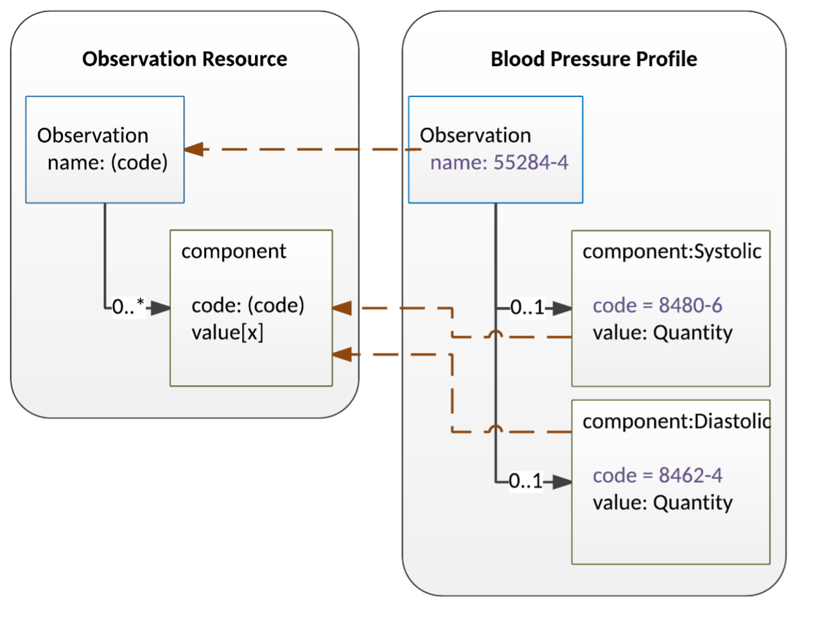
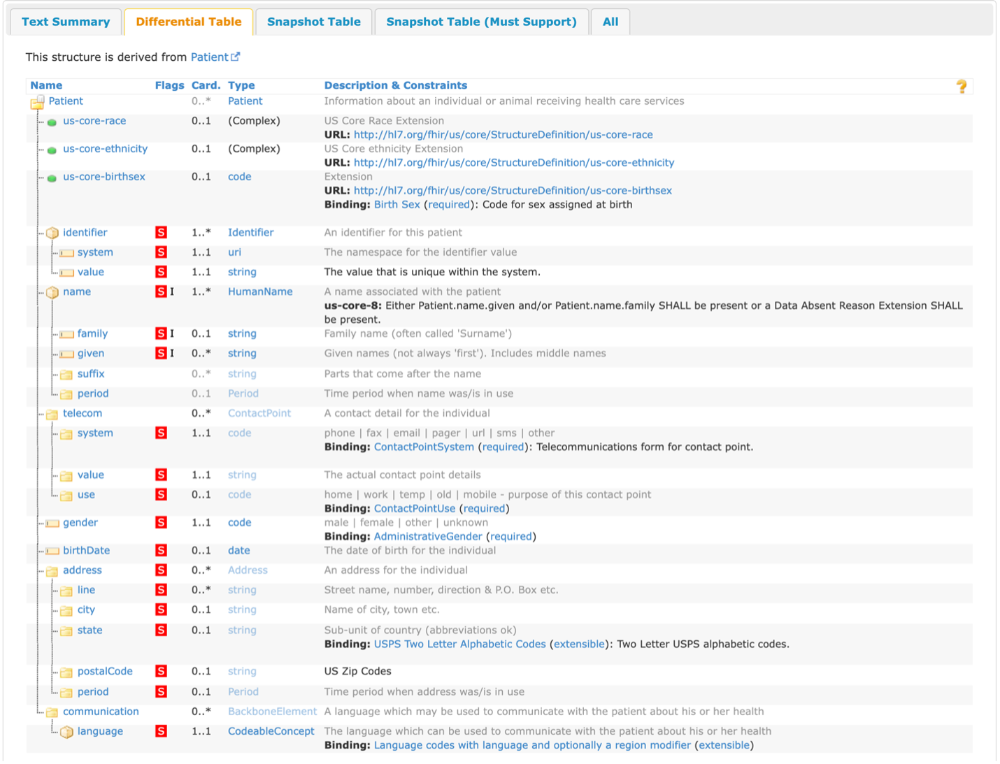
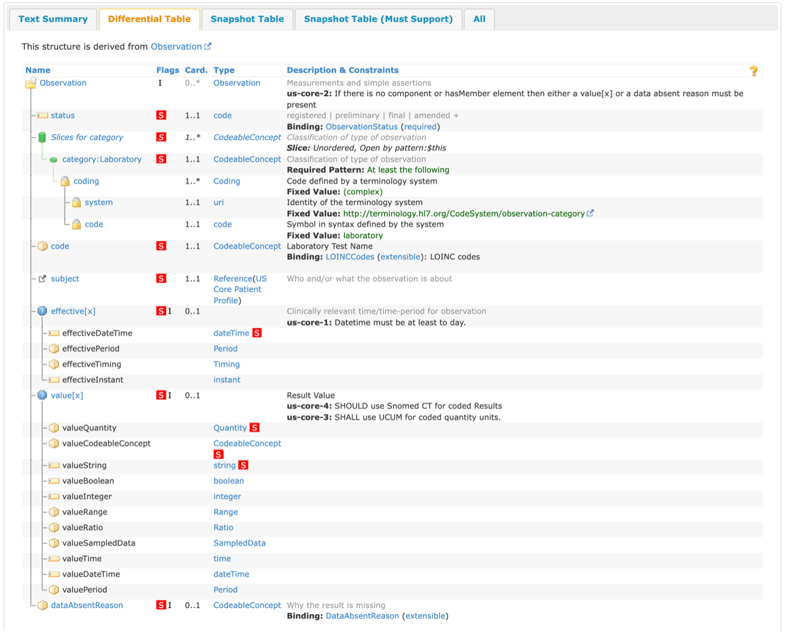
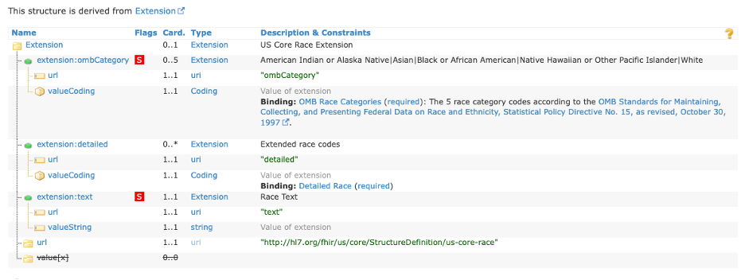

FHIR IGs: Profiles
==================

Profiles are going to be the most common conformance resource found in a FHIR IG. A profile is a set of rules around how a FHIR resource should be used in the context of the IG, as well as any additional elements that may need to be added to support the use case of the IG. Profiles can be created for any FHIR resource needed for the context of the IG, such as Patient, Condition, or Observation. There are at least six different ways that a profile can constrict or “change” (change being a loose term since profiles are not changing the base FHIR specification) a FHIR resource:

* Extending a data element by adding an Extension (see Extensions for more detail)
* Changing the cardinality of an element
* Restricting an allowed data type for a choice element
* Fixing a value of an element
* Constricting the value set from which a code, Coding, or CodeableConcept can come from for a data element
* Adding a flag to a data element

Changing the Cardinality
^^^^^^^^^^^^^^^^^^^^^^^^
Every data element in a FHIR resource has a cardinality: the lower and upper bounds for how often an element can appear in a resource. This is represented in the following notation in the FHIR specification: lower .. upper. The most common cardinalities are 0..1 (not required but the element can only exist once in the instance of a resource), 0..* (not required but the element can exist infinitely many times in the instance of a resource), 1..1 (required but the element can only exist once in the instance of a resource), and 1..* (required but the element can exist infinitely many times in the instance of a resource). This cardinality can only be restricted within the bounds of the base FHIR specification; it cannot be expanded. The table below shows an example of what is and isn't allowed:

+------------------------+------+------+------+------+------+
| Derived (across)       | 0..0 | 0..1 | 0..n | 1..1 | 1..n |
| Base (down)            |      |      |      |      |      |
+========================+======+======+======+======+======+
|  0..1                  | Yes  | Yes  |  No  | Yes  |  No  |
+------------------------+------+------+------+------+------+
|  0..*                  | Yes  | Yes  | Yes  | Yes  | Yes  |
+------------------------+------+------+------+------+------+
|  1..1                  |  No  |  No  |  No  | Yes  |  No  |
+------------------------+------+------+------+------+------+
|  1..*                  |  No  |  No  |  No  | Yes  | Yes  |
+------------------------+------+------+------+------+------+

Restricting a Choice Element
^^^^^^^^^^^^^^^^^^^^^^^^^^^^
Within the base FHIR specification, there are elements labeled with a [x] that are called choice elements, these elements can take the form of multiple data types depending on the implementation. For example, the value[x] element in the Observation resource can take on one of 12 different data types depending on the implementation. A profile can restrict these choice elements to either a subset of the original choices or a single data type. This also applies to elements that have a type of Reference with multiple choices of other resources for the reference, it can even be restricted to be a Reference to a resource that conforms to another one of the IG's profiles.

Fixed Values and Bindings
^^^^^^^^^^^^^^^^^^^^^^^^^
For some data elements in FHIR, there is a fixed value, which means that that element can only equal that fixed value in a data structure (if it has 1..n cardinality, it will always be in any instance of that resource but 0..n means that it's not required to exist in any instance of the resource). For some other data elements (always elements with a code, Coding, or CodeableConcept data type), there might be a binding with a defined value set. In the FHIR specification, there are four different binding strengths that can exist for the relationship between a data element and a value set, shown in the below table (taken from the FHIR specification):

+------------+----------------------------------------------------------------------------------------------------------------------------------+
| Strength   | Definition                                                                                                                       |
+============+==================================================================================================================================+
| Required   | To be conformant, the concept in this element SHALL be from the specified value set                                              |
+------------+----------------------------------------------------------------------------------------------------------------------------------+
| Extensible | To be conformant, the concept in this element SHALL be from the specified value set if any of the codes within the value set can |
|            | apply to the concept being communicated. If the value set does not cover the concept (based on human review), alternate codings  |
|            | (or, data type allowing, text) may be included instead.                                                                          |
+------------+----------------------------------------------------------------------------------------------------------------------------------+
| Preferred  | Instances are encouraged to draw from the specified codes for interoperability purposes but are not required to do so to be      |
|            | considered conformant.                                                                                                           |
+------------+----------------------------------------------------------------------------------------------------------------------------------+
| Example    | Instances are not expected or even encouraged to draw from the specified value set. The value set merely provides examples of    |
|            | the types of concepts intended to be included.                                                                                   |
+------------+----------------------------------------------------------------------------------------------------------------------------------+

Preferred is going to be the least common binding strength found both in the FHIR specification as well as any FHIR IGs, as most FHIR IGs are going to make use of the “required” binding strength since they are constricting the base specification to a specific use case.

Value sets must exist somewhere for a data element to have a binding relationship with it. Most commonly they will be found within the realm of HL7 terminology, but can also exist within CDC's PHINVADS, NIH's VSAC, or can be defined within the FHIR IG as a ValueSet within the IG (see ValueSets for more information on custom ValueSets).

The table below shows how a binding strength could be changed in a profile (note that the constraining profile can change either the strength or the value set of the binding, but whatever the profile does, it cannot make codes valid that are invalid in the base specification):

+------------------------+----------+------------+-----------+---------+
| Derived (across)       | required | extensible | preferred | example |
| Base (down)            |          |            |           |         |
+========================+==========+============+===========+=========+
|  requires              | Yes      | No         | No        |     No  |
+------------------------+----------+------------+-----------+---------+
|  extensible            | Yes      | Yes        | No        |     No  |
+------------------------+----------+------------+-----------+---------+
|  preferred             | Yes      | Yes        | Yes       |     No  |
+------------------------+----------+------------+-----------+---------+
|  example               | Yes      | Yes        | Yes       |    Yes  |
+------------------------+----------+------------+-----------+---------+

Flagging a Data Element
^^^^^^^^^^^^^^^^^^^^^^^
The final way explored in this document that a profile can constrict a FHIR resource is by adding a flag to the data element. This almost always occurs with a mustSupport flag, where an IG can add this flag to indicate that systems claiming to conform to a given profile must "support" the element. This is distinct from cardinality; it is possible to have an element with a minimum cardinality of 0 but still expect systems to support the element. Note that the base FHIR specification does not define “support,” but if a profile chooses to include the flag, it must also describe what kind of “support” is expected. Examples of this include:

* The system must be able to store and retrieve the element
* The system must display the element to the user and/or allow the user to capture the element via the UI
* The element must appear in an output report
* The element must be considered when performing decision support, calculations, or other processing

Slicing
^^^^^^^
A common feature found in profiles in a FHIR IG is slicing. Slicing is the act of taking an element that may appear multiple times (for example, in a list) and splitting the list into a series of sub-lists, each with different restrictions on those sub-lists. This is an example taken from the FHIR specification:

The base Observation resource is on the left, with the derived Blood Pressure Profile on the right. In this example, we are slicing the data element component into two slices: systolic and diastolic (since there are two components to a blood pressure observation, you would use the component elements with separate codes and values versus having two separate Observations). The component has been sliced into those two slices, each one with a fixed value of the code for systolic and diastolic, respectively, with a restriction on value[x] to be of type Quantity. More information on the details of slicing is found here http://www.hl7.org/fhir/r4/profiling.html#slicing.

Invariants (or Constraints)
^^^^^^^^^^^^^^^^^^^^^^^^^^^
A profile can also contain what are called either constraints or invariants (invariants will used for the rest of the document to provide clarity between these statements and any changes a profile may make to a resource). These are FHIRPath expressions that must evaluate to true when run against an element in an instance for a resource to be considered conformant to the IG. An example of this is:

+------------+--------------+-----------------------------------------------------------------------------------------------------------+
| Key        | Path         | Description                                                                                               |
+============+==============+===========================================================================================================+
| us-core-8  | Patient.name | Either ``Patient.name.given`` and/or ``Patient.name.family`` SHALL be present or a Data Absent Reason     |
|            |              | Extension SHALL be present: ``(family.exists() or given.exists()) xor                                     |
|            |              | extension.where(url=\'http://hl7.org/fhir/StructureDefinition/data-absent-reason\').exists()``            |
+------------+--------------+-----------------------------------------------------------------------------------------------------------+

Formal Views of Profile Content
^^^^^^^^^^^^^^^^^^^^^^^^^^^^^^^
Each FHIR IG has a section labeled as “Formal Views of Profile Content,” this section has an interactive box with five different tabs: Text Summary, Differential Table, Snapshot Table, Snapshot Table (Must Support), and All. The “Text Summary” tab gives a summary of the profile: what resource it constrains, how many mandatory and must support elements there are, any other profiles the profile may refer to, and any extensions the profile may refer to. The “Differential Table” tab shows all the elements that the profile has changed: adding a mustSupport flag, restricting the cardinality (indicated with black text versus gray text), restricting the data type, changing the terminology binding, or any invariants that may have been defined for the profile. The “Snapshot Table” tab shows a blend of the differential table and the base resource structure, by showing all elements for this profiled resource. The “Snapshot Table (Must Support)” tab only shows all the data elements that have been flagged with the mustSupport flag. The “All” tab shows all of the previous four views on the same page.

Examples
^^^^^^^^
As mentioned previously, all examples shown in this document come from the US Core FHIR IG.

US Core Patient
~~~~~~~~~~~~~~~
Shown below is the differential table from the US Core Patient Profile:

From this table, there are three extensions defined that have a cardinality of 0..1, with two of them being “(Complex)” extensions and one being a code. These extensions will be covered in the Examples section below for extensions, as well as what “(Complex)” extensions are. There are a total of 18 elements that have been flagged as mustSupport (as defined above) and three mandatory top-level elements (compared to the base Patient which has 0 mandatory top-level elements). On Patient.name, the invariant previously mentioned has been applied to this element, indicating that an instance of a resource claiming conformance to this profile must follow that invariant.

US Core Laboratory Result Observation
~~~~~~~~~~~~~~~~~~~~~~~~~~~~~~~~~~~~~
Shown below is the differential table from the US Core Laboratory Result Observation Profile:

In this differential table, you can see an example of slicing that was mentioned before. For this example, the profile changed the cardinality of category from 0..* in the base Observation to 1..* for this profile, indicating that there should be at least one category code associated with an instance of a resource conforming to this profile. In this case, the slice “Laboratory” has a cardinality of 1..1 and has a fixed value of laboratory, indicating that this category code will appear in every instance of a resource conforming to this profile. Because the cardinality is 1..*, other category codes could be included, but those do not have any additional constraints beyond the base specification.

For this profile, there are 12 mustSupport flags and four mandatory top-level elements. For Observation.code, there is an example of the profile changing the binding strength for the associated value set. In the base specification, the value set “LOINCCodes” has a binding of example, but for this profile, it has a strength of “extensible.” There are also four invariants applied to this profile, one for the entire Observation and three for individual elements within the resource. It's also demonstrated here the concept of mustSupport and constraints. For Observation.value[x], there are mustSupport flags on three of the data types, but the other data types from the base specification are still allowed.

Extensions
~~~~~~~~~~
Sometimes when profiling FHIR for your use case, you may come across a situation where you don't need to limit a resource, but rather add elements. This is where Extensions come in, they can be added to any data element (from the base resource down to the most nested element) to represent additional information that is not present in the base resource. Extensions must contain a URL to define what it means to have that extension as well as a value[x] element (see Restricting a Choice Element to hear more about value[x], as well as go to Open Type Element to see the full list of datatypes this element can have).

Sometimes, you may need to have multiple values to represent the full meaning of an extension and instead of doing multiple extensions, you can have an extension which contains sub-extensions. This is referred to as a complex extension, and excellent examples of this are the US Core Race and Ethnicity extensions. Both contain three sub-extensions: a required extension with a url of ombCategory and a valueCoding from the OMB Race Categories ValueSet, an optional extension with a url of detailed and a valueCoding from the Detailed Race ValueSet, and a required extension with a url of text and a valueString. The StructureDefinition for the US Core Race extension is shown below:

Another rule to note with using sub-extensions that you can see demonstrated in the StructureDefinition above: you cannot have sub-extensions as well as a value[x] element, this muddies the meaning of the extension.

Another concept that can be found with extensions is the presence of an is-Modifier flag, which makes them modifier extensions. A modifier extension is where the information provided in an extension modifies the meaning of the element that contains it. Often, this means information that qualifies or negates the primary meaning of the element that contains it. An example of this is a flag on a [Patient.contact] indicating they are not to be contacted - i.e. a next of kin for record-keeping purposes only. IG developers should try to stay away from modifier extensions wherever possible because it can change the meaning of an element in a resource and can add confusion to data.